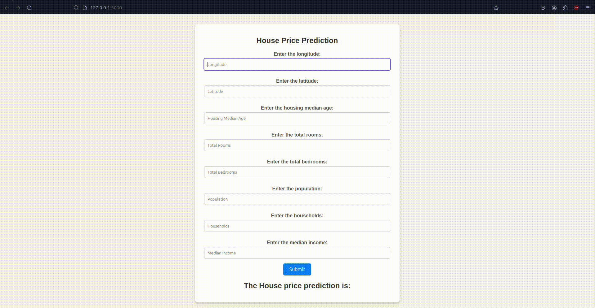

# California House Price Prediction

## Project Overview

The **California House Price Prediction** project is a Flask-based web application that predicts house prices in California based on user-provided input features. It uses a trained ElasticNet regression model and a preprocessing scaler to make predictions. The goal is to provide a simple and user-friendly interface for users to input data and get real-time predictions of house prices.

---

## Features

- **Dynamic Form-Based Input**: Users can input features such as:  `longitude`, `latitude`, `housing_median_age`, `total_rooms`, `total_bedrooms`, `population`, `households`, `median_income`
- **Real-Time Prediction**: The app provides house price predictions instantly based on the provided inputs.
- **Model Integration**: Uses a `pre-trained ElasticNet` regression model for predictions.
- **Interactive Web Interface**: `Built with Flask `for an intuitive and seamless user experience.

---

## Tech Stack

- **Backend**: Python (Flask)
- **Machine Learning**: Scikit-learn (ElasticNet Regression)
- **Frontend**: HTML, CSS
- **Deployment**: Flask Development Server

---

## Prerequisites

Before running the project, ensure the following are installed:

- Python 3.10+
- scikit-learn
- pandas
- ipykernel
- numpy
- matplotlib
- pandas
- seaborn
- requests
- bs4
- Flask
- imblearn
- openpyxl
- statsmodels

## Installation and Setup

1. **Clone the repository**:
   ```bash
   git clone https://github.com/mShubham18/California-House-Price-Prediction
   cd California_House_price
   ```
2. **Install the modules**:
   ```bash
   pip install -r requirements.txt
   ```
3. **Run the Flask app**:
   ```bash
   python run application.py
    ```

## Screenshot
- **Screenshot :** <br /><br />
    
- **Screen Recording :** <br /><br />
    

## Example Input and Output
Example Input:
    
    Longitude: -118.0
    Latitude: 34.0
    Housing Median Age: 29
    Total Rooms: 500
    Total Bedrooms: 150
    Population: 1000
    Households: 300
    Median Income: 4.5

Example Output:

    The predicted house price is: 280000.00

**That's it folks, Happy Learning :)**